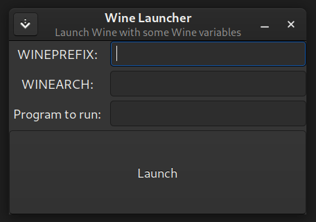

# Wine Launcher for Pardus 21

Launch Wine with some Wine variables (for Pardus 21).

## Running
After cloning this repository, update translation strings:

    ./update_strings.sh

After that, you can run with this command:

    ./wine-launcher

## Author
Erdem Ersoy (eersoy93)

## License
CC0-1.0. See LICENSE file.
